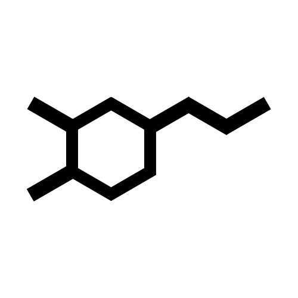

<div align="center">
  
</div>

# DOPAMINE

## Get started

1. To clone the repo and its [submodules](https://git-scm.com/book/en/v2/Git-Tools-Submodules) :

```sh
git clone git@github.com:PFE014-H22/DOPAMINE.git
cd DOPAMINE
git submodule init
git submodule update
```

2. Build the app
```sh
docker compose build
```

3. Run the app

```sh
docker compose up
```

## To contribute to the project

The `backend` and `frontend` folders have their respective repository and are added to this repository as git submodules ([to learn more about submodules](https://git-scm.com/book/en/v2/Git-Tools-Submodules)).

1. Make your changes in the specific repository then push the changes

2. Once the repos is stable run this command to add the changes to the DOPAMine repo
```sh
git submodule update --remote
```
> Currently, this command will fetch changes pushed on develop for both submodules. To change the watched branch, you can execute this command 
```sh
git config -f .gitmodules submodule.[module_name].branch [branch_name]
```
> ex : `git config -f .gitmodules submodule.backend.branch develop`
